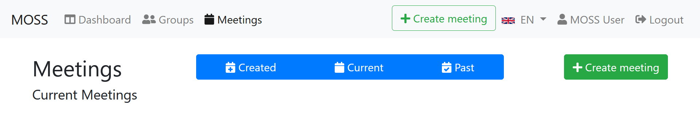
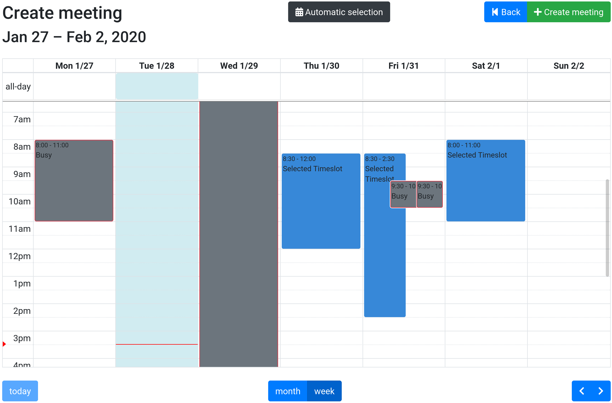
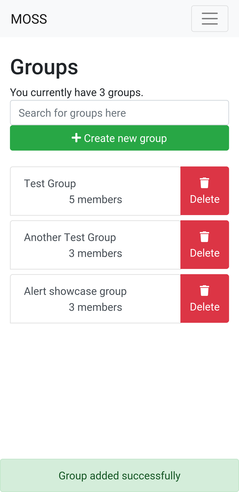
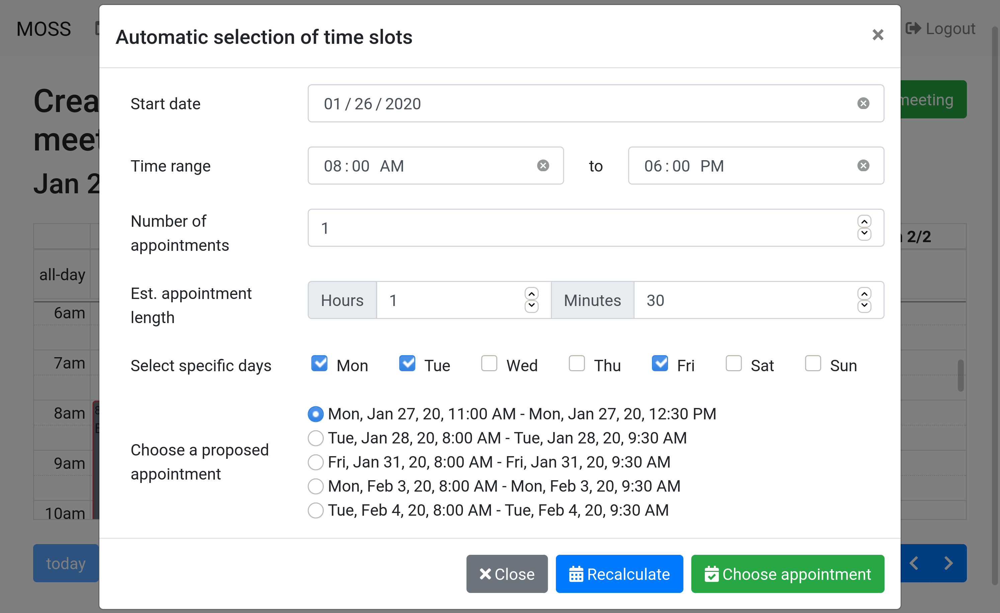

# Meeting-Organizer-Scheduling-Software
An Angular (8) application (prototype at this point) trying to solve the manual labor of scheduling meetings.

## Description
Scheduling meetings has become one of the most important aspects within business environments. Calendars are full with events, meetings consist of dozens of people and thus organizing a meeting
in which every participant has the possibility to attend.
Meeting Organizer Scheduling Software (**MOSS**) tries to solve exactly this issue by (not only) offering an automated selection process during time slot selection.
This alleviates the hard work from the organizer by searching through participants' calendars and determining vacant time slots in a private manner.
MOSS currently communicates with the following third-party calendar services:
* [Google Calendar](https://calendar.google.com)
* [Microsoft Exchange](https://outlook.live.com/calendar) (non-private servers [#4](/../../issues/4))
* [ICS iCalendar import](https://en.wikipedia.org/wiki/ICalendar)

Communication with these services is privacy preserving as users do not get to see anything other than busy times from other users.
In general, MOSS is built to preserve privacy and will not leak any data to unauthorized individuals.

## Features

* [X] Automated selection of vacant time slots
* [X] Grouping system
* [X] Individual user priority during event invitation
* [X] Two-Factor Authentication
* [ ] Two-Factor Authentication Backup Codes
* [ ] ICS Export
* [ ] Allowing event organizers to upload PDFs
* [ ] Invitation of unregistered users
* [ ] Allowing invited users to invite further participants
* [ ] Extended Grouping features
* [ ] Live-updates?
* [ ] More languages?
* [ ] Possibly provision of desktop/mobile app?

## Components used
### Front-end
- [Angular 8](https://angular.io/) (will be updated asap)
- [Bootstrap 4](https://getbootstrap.com/)
- [Font Awesome](https://getbootstrap.com/)
### Back-end
- [Node.JS](https://nodejs.org/en/)
- [Mongoose](https://mongoosejs.com/) (MongoDB driver)
- [Express](https://expressjs.com/) (REST API)
- [Nodemailer](https://nodemailer.com/about/) (Mail services)
### Database
- [MongoDB](https://www.mongodb.com/)
As there is no set up process, no other database is currently considered

## Screenshots

<table>
  <tr>
    <td>
      
    </td>
    <td rowspan="2">
      
    </td>
  </tr>
  <tr>
    <td>
    
    </td>
  </tr>
</table>

## Requirements
* A functional MongoDB setup, preferrably with authentication
* Node.JS
* npm

## Installation (quick)
For a full installation guide, go to the [installation guide](docs/installation-guide/README.md)
### Front-end
Clone the repo then execute
```
$ cd meeting-organizer-scheduling-software/
$ npm install
```
Change the file `meeting-organizer-scheduling-software/src/environment.ts`

Enter specific API credentials gotten from the respective dashboards. Leave REDIRECT_URL and SCOPES the same.
```
// Google API
G_API_CLIENT_ID:          '',
G_API_CLIENT_SECRET:      '',
G_API_REDIRECT_URL:       `http://${location.host}/profile/calendars/auth/google`,
// Microsoft Graph API
M_API_APP_ID:             '',
M_API_SCOPES:             ["user.read", "calendars.ReadWrite", "offline_access"],
M_API_SCOPES_URI:         "https://graph.microsoft.com/Calendars.ReadWrite https://graph.microsoft.com/User.Read offline_access openid profile",
M_API_REDIRECT_URI:       `http://${location.host}/profile/calendars/auth/microsoft`,
```

### Back-end

```
$ cd ../moss-backend
$ npm install
$ cp example.env .env
```
Edit the just copied `.env` file according to the API credentials. Note that Apple is not supported (yet?).
## Usage
Two terminals are needed (tmux might help!)

### Front-end
```
$ cd meeting-organizer-scheduling-software/
$ ng serve --open
```

### Back-end
```
$ cd moss-backend
$ npm start
```
This should be displayed in the console:
```
Server has started
Connected to Database
Server ready to send messages
```

## Known issues
* Due to the nature of OAuth2.0, if only localhost is entered within Google's or Microsoft's developer dashboards, clients accessing the server from a non-localhost device cannot connect third party calendars. This can be circumvented by giving the server a domain and access it through that.
* The selection algorithm is not perfect: It ignores user priority and contains other breaking bugs